# Общие понятия (кратко)

**GitHub** — веб-платформа для хранения и совместной работы с кодом и текстами.

**Репозиторий (repository)** — проект с файлами и историей изменений.

**Шаблон репозитория (template repository)** — заготовка проекта.

**Коммит (commit)** — зафиксированное изменение.

**Ветка (branch)** — отдельная линия изменений.

**Pull Request (PR)** — запрос на включение ваших изменений в основной репозиторий.

**Ревью (review)** — проверка ваших изменений другими участниками.

# Создание репозитория на основе шаблона
1. Вход в GitHub
   * Перейдите на https://github.com
   * Войдите в свой аккаунт (или зарегистрируйтесь).
   
2. Создание репозитория из шаблона
   * Перейдите на страницу репозитория-шаблона https://github.com/OtusSystemDesign/system-design-homework.
   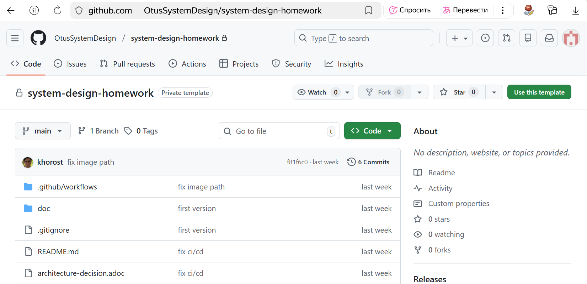
   * Нажмите кнопку **Use this template**.
   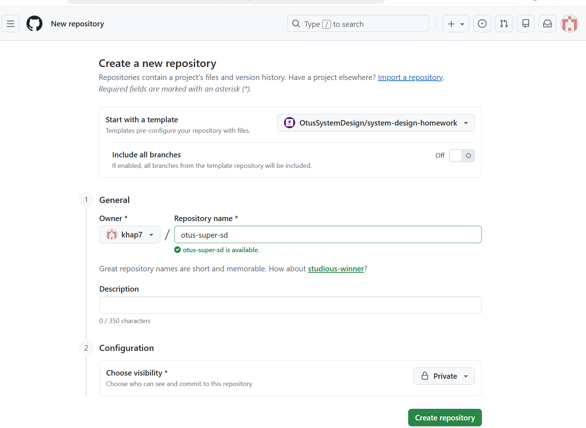 
   * Выберите:
     * **Owner** — ваш аккаунт или организация.
     * **Repository name** — имя нового репозитория.
     * **Visibility** — Public или Private.
   * Нажмите **Create repository**.
     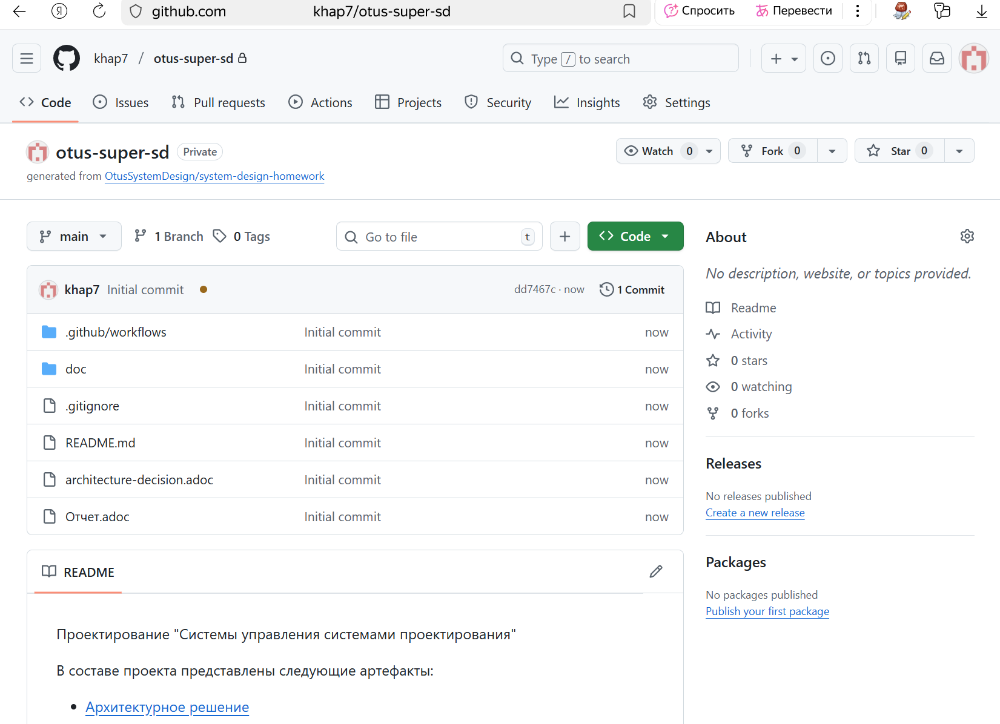

Результат: у вас появился собственный репозиторий, независимый от шаблона.

3. Добавить проверяющего/соучастника:
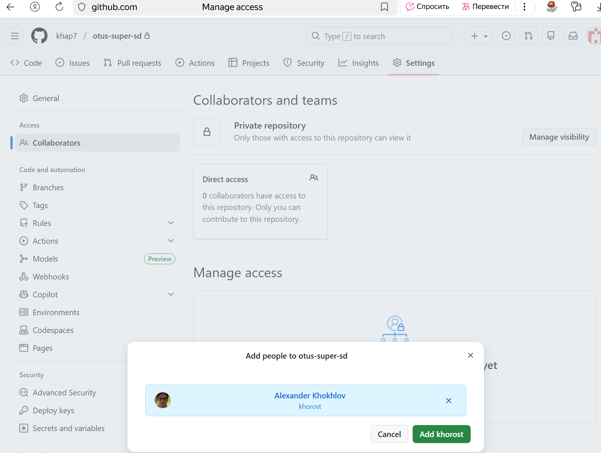

Проверяющему будет отправлено приглашение. Добавление проверяющего обязательно для приватных репозиториев.

# Выполнение работы и отправка Pull Request
## Клонирование репозитория на компьютер
   * Откройте свой репозиторий на GitHub.
   * Нажмите Code → HTTPS → Copy.
   * В терминале выполните:
```
git clone <скопированный_адрес>
```
 
   * Перейдите в папку проекта:
```
cd имя-репозитория
```

   * Альтернативно можно использовать клонирование в IDE, например в Visual Source Code: 
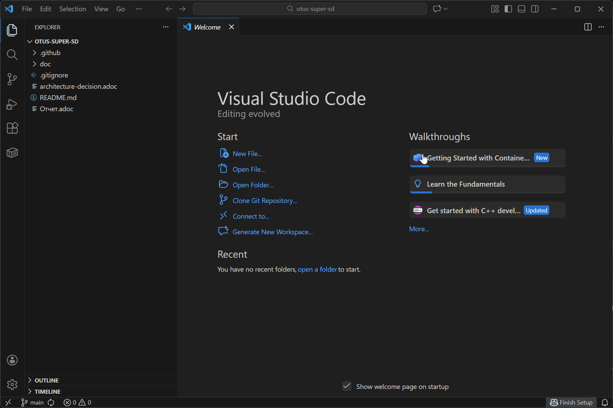
   * при работе с Visual Source Code рекомендуется поставить следующие расширения:
     * GitHub Pull Requests
     * AsciiDoc

## Создание рабочей ветки

Работать не в main/master, а в отдельной ветке. Ветку называем по шаблону **hw_XX**, где **ХХ** - номер домашнего задания.

```
git checkout -b hw_01
```
Можно создавать ветки и из IDE.

## Выполнение работы

Открываете нужные файлы и редактируете.
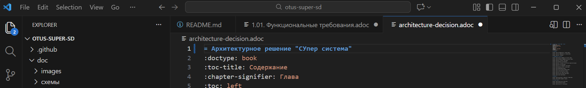

⚠️ Обязательно в главном файле указать наименование проекта.

Можно добавлять удалять файлы.

Не забывайте сохранить файлы. Некоторые редакторы делают это автоматически, но Visual Source Code хочет явного сохранения. Можно например сделать по гоярчей комбинации **CTRL-S**.

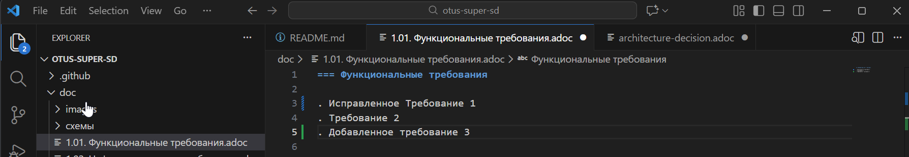

## Фиксация изменений (commit)
Через командную строку:
```
git status            # посмотреть, что изменилось
git add .             # добавить изменения
git commit -m "Добавлен текст для раздела X"
```
Можно в приложении:
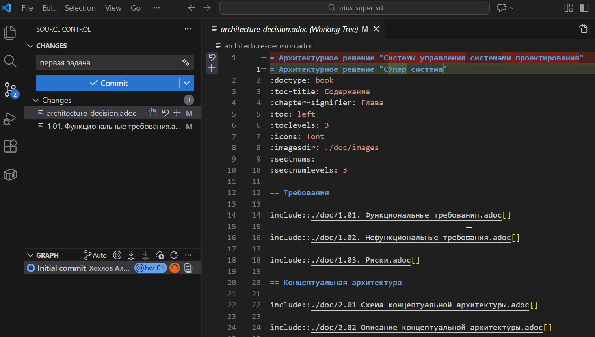

В приложении показыааются измененные файлы, а также именно поменялось. Не забываем явно указать что добавляем в отправку лог изменений, а что пока придержим. Также можно отметить файлы которые нужно удалить из лога изменений.

При фиксации (комит) обязательно требуется ввести комментарий, по ним потом проще навигироваться.

## Отправка изменений на GitHub
```
git push origin hw_01
```
Можно отправлять и через меню в приложении. 

Отправку на сервер можно выполнять как после каждого комита, так и пачкой. Выбирвать комиты при этом не нужно, отправляется все что сейчас готово.  


## Создание Pull Request

Чтобы передать изменения на проверку нужно создать Pull Request.

Перейдите в свой репозиторий на GitHub. 

GitHub предложит создать PR — нажмите Compare & pull request
(или Pull requests → New pull request).

Убедитесь, что:
* Base branch: main
* Compare branch: feature/my-work

Заполните:
* Title — кратко, что сделано.
* Description — что именно изменено и зачем.

Нажмите **Create pull request**.

Если установлено расширение для работы с PR то их можно создавать из IDE.
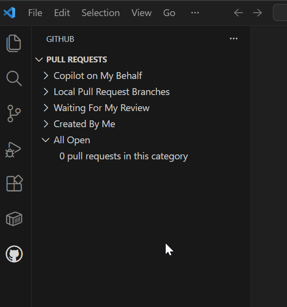

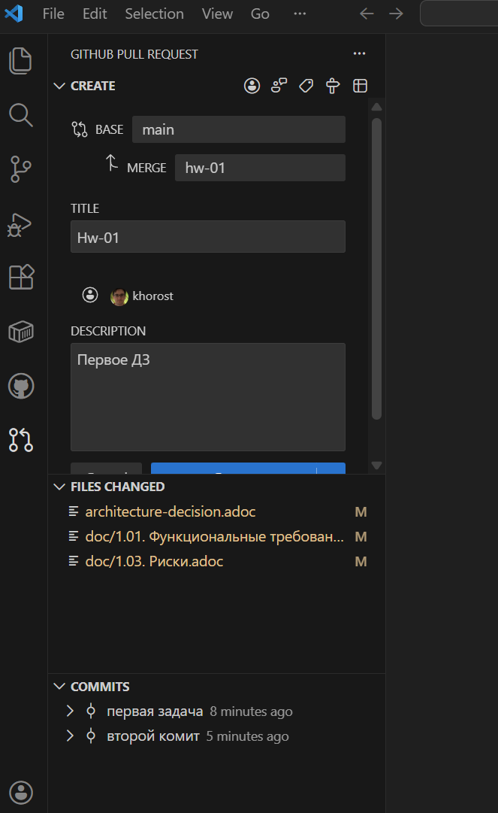

Для отправки в ЛК нужно получить ссылку на PR. На скриншоте ниже она находится под #1.
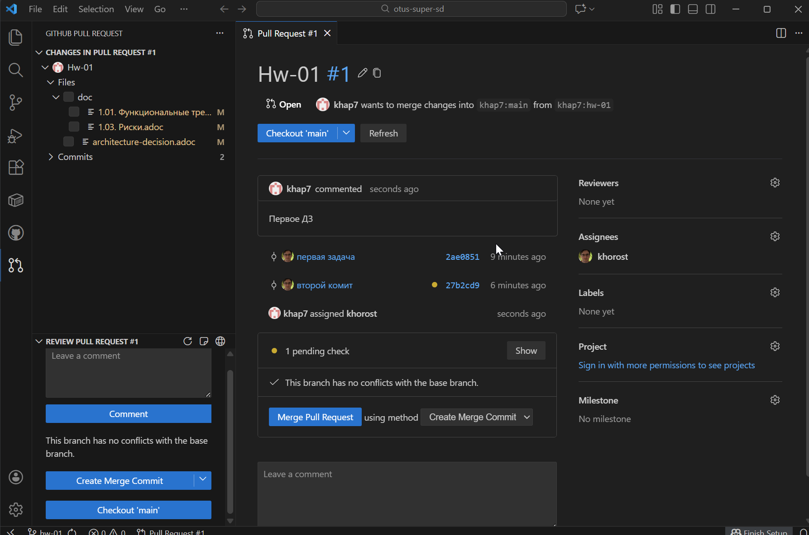

# Чтение ревью, доработка и ответы на замечания

## Получение ревью

* Ревьюеры оставят комментарии:
  * к конкретным строкам;
  * или общие замечания.

## Как читать комментарии

* Откройте Pull Request.
* Перейдите на вкладку Files changed или Conversation.
* Внимательно прочитайте все замечания.

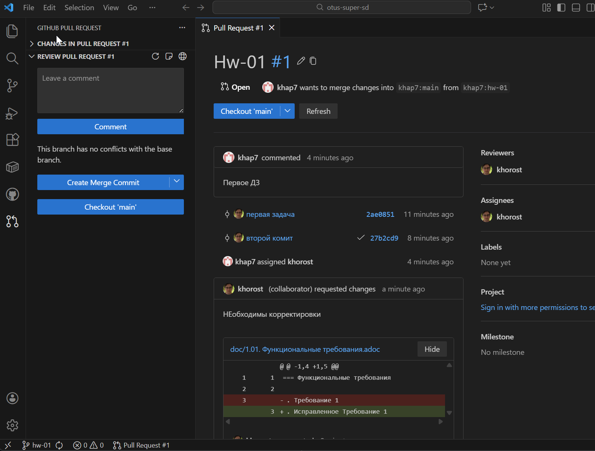

## Внесение исправлений

* На компьютере внесите изменения в той же ветке.
* Зафиксируйте изменения:
```
git add .
git commit -m "Исправления по ревью"
```
* Отправьте обновления:
```
git push origin hw_01
```

PR обновится автоматически.

## Ответы на комментарии

* В GitHub под каждым замечанием:
  * напишите, что исправлено;
  * или задайте уточняющий вопрос;
  * или аргументированно объясните, почему изменение не требуется.
* Используйте кнопку Resolve conversation, если замечание устранено.

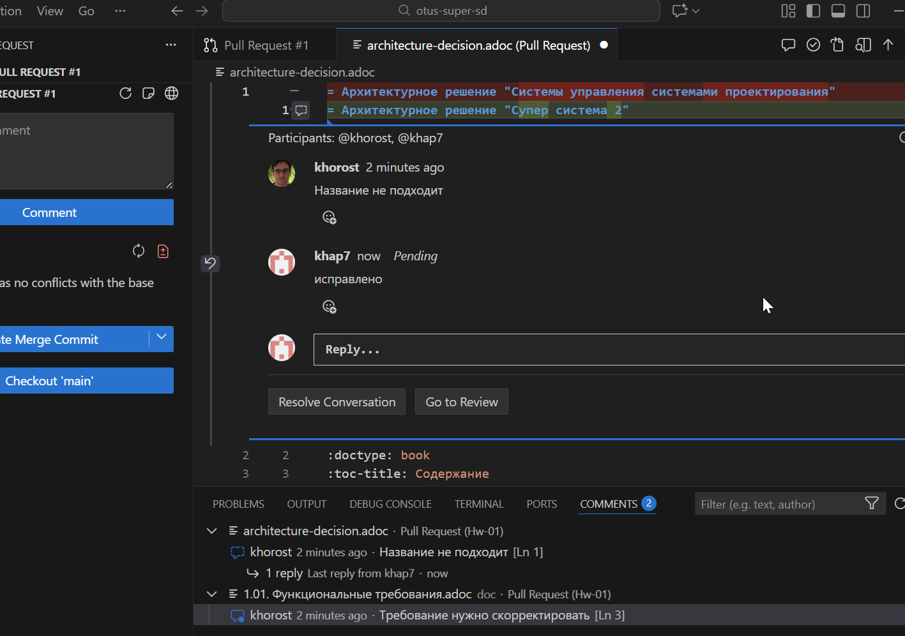

## Принятие изменений (Merge)

Если ревью пройдено (Статус проверки Approved):
* Ревьюер или ответственный нажимает Approve.
* Далее выполняется Merge pull request:
  * Merge commit / Squash / Rebase — как принято в проекте, у нас будет Merge.
* PR закрывается автоматически.

⚠️ Обычно автор PR не делает merge сам, но у нас автор будет делать если считает что работа по ДЗ завершена.

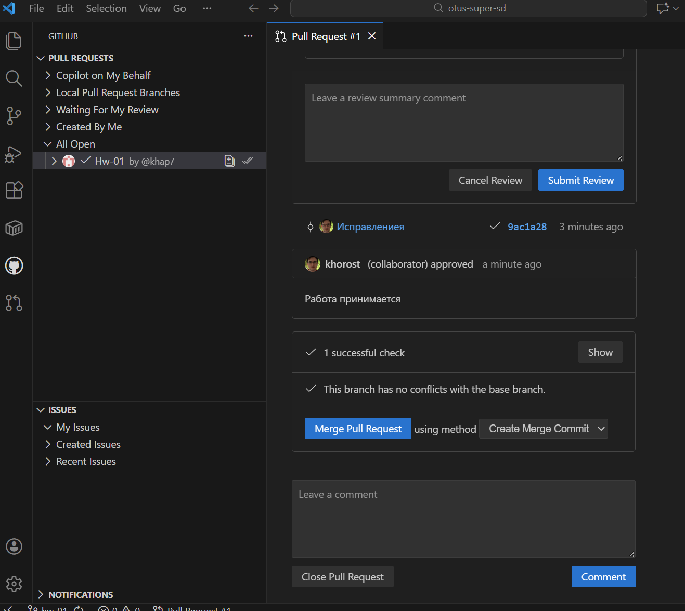

Итог можно проверить в гитхабе. Итоговая подтвержденная версия изменений появляется в гланой ветке репозитория. 
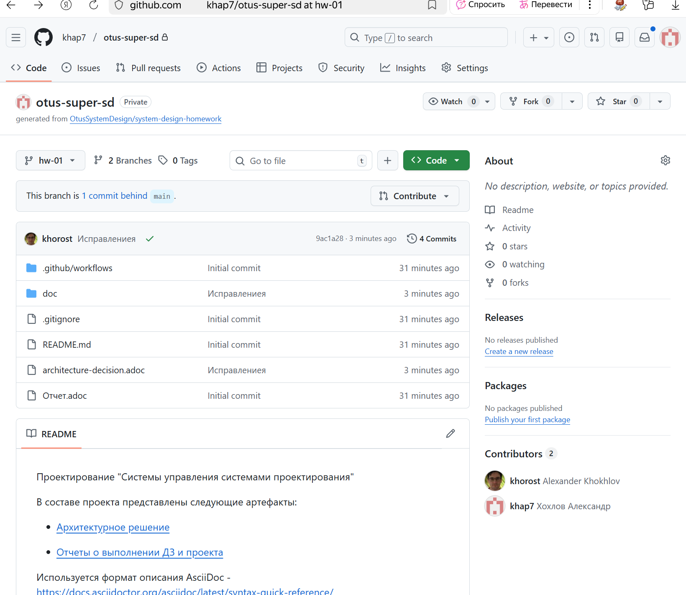

История изменений при этом остается в ветке hw_01 и PR Hw-01. 


# Подготовка к следующей работе и новый PR
* Обновление основной ветки
```
git checkout main
git pull origin main
```

* Создание новой рабочей ветки

Для каждой новой задачи — новая ветка:
```
git checkout -b hw_02
```

* Повтор цикла
  * Внести изменения.
  * Commit.
  * Push.
  * Новый Pull Request.

⚠️ Важно - делать все последовательно, сначала приименяем (merge) решения с предыдущего ДЗ, а после этого переходим к следующему. Иначе будет риск что какая информация не будет применена или на ревью подйет дважды. 
