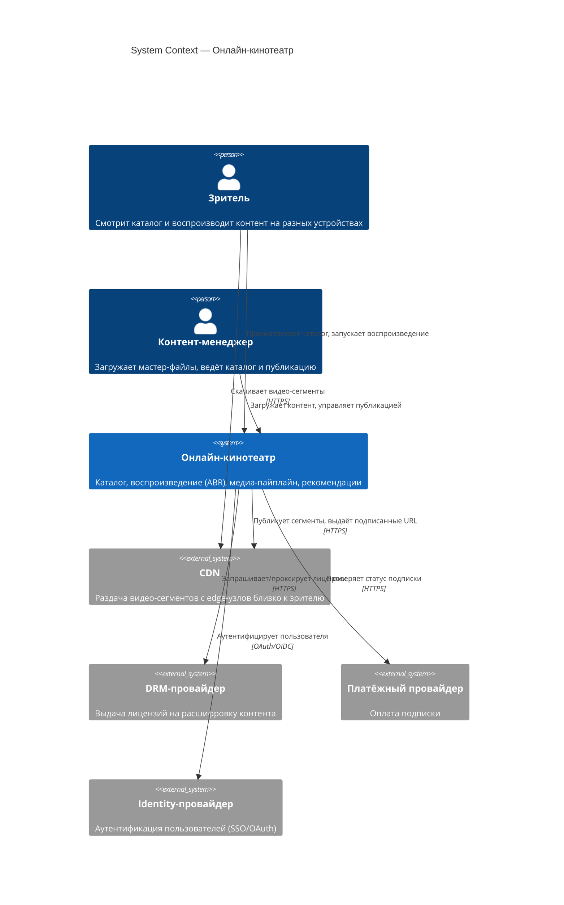
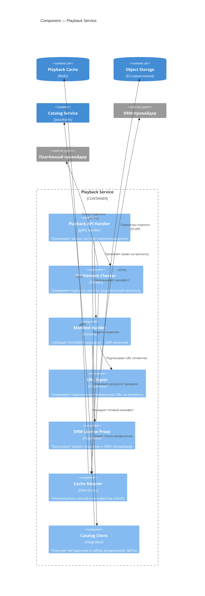

# C4 — Онлайн-кинотеатр

Три уровня по модели C4. Уровни не смешиваем: на Level 1 — только система, акторы и внешние системы; на Level 2 — контейнеры (отдельно деплоимые единицы); на Level 3 раскрываем **один** контейнер — Сервис воспроизведения (Playback Service).

---

## Level 1 — System Context

Показывает границу системы и её окружение: кто пользуется онлайн-кинотеатром и от каких внешних систем он зависит.

**Граница системы:** всё внутри «Онлайн-кинотеатр» — наше. CDN, DRM-провайдер, платёжный и identity-провайдеры — внешние, мы их интегрируем, но не разрабатываем. Обратите внимание: зритель качает сегменты напрямую с CDN (пунктир бизнес-смысла: тяжёлый трафик не идёт через наши сервисы).

---

## Level 2 — Container

Контейнеры — отдельно деплоимые единицы (это **не** Docker-контейнеры). У каждого — технология и однострочное назначение.

```mermaid
C4Container
    title Container — Онлайн-кинотеатр

    Person(viewer, "Зритель")
    Person(manager, "Контент-менеджер")

    System_Boundary(cinema, "Онлайн-кинотеатр") {
        Container(clientApp, "Клиентское приложение", "Smart TV / iOS / Android / Web", "Каталог, плеер с ABR-логикой")
        Container(api, "API Gateway / BFF", "Go", "Точка входа, аутентификация, агрегация ответов")
        Container(catalog, "Catalog Service", "Java/Kotlin", "Метаданные тайтлов, поиск, доступность по регионам")
        Container(playback, "Playback Service", "Go", "Манифесты, entitlements, подписанные URL, DRM-проксирование")
        Container(reco, "Recommendation Service", "Python", "Выдача персональных подборок (precompute + реранкинг)")
        Container(ingest, "Ingest / Pipeline Orchestrator", "Go", "Приём мастер-файлов, оркестрация транскодинга")
        Container(transcoder, "Transcoding Workers", "FFmpeg/GPU", "Транскодинг и упаковка (HLS/DASH) сегментов")
        Container(telemetry, "Telemetry Service", "Go", "Приём heartbeat и QoE-событий просмотра")

        ContainerDb(catalogDb, "Catalog DB", "PostgreSQL", "Метаданные каталога, доступность")
        ContainerDb(playbackCache, "Playback Cache", "Redis", "Сессии, манифесты, entitlements (TTL)")
        ContainerDb(recoStore, "Reco Store", "Redis/Key-Value", "Предрассчитанные подборки на пользователя")
        ContainerDb(objStore, "Object Storage", "S3-совместимое", "Мастер-файлы и видео-сегменты (origin)")
        ContainerQueue(jobQueue, "Job Queue", "Kafka/SQS", "Очередь заданий транскодинга и событий")
    }

    System_Ext(cdn, "CDN")
    System_Ext(drm, "DRM-провайдер")
    System_Ext(payment, "Платёжный провайдер")
    System_Ext(idp, "Identity-провайдер")

    Rel(viewer, clientApp, "Использует")
    Rel(manager, api, "Загрузка контента, публикация", "HTTPS")

    Rel(clientApp, api, "REST/HTTPS")
    Rel(clientApp, cdn, "Качает манифест и сегменты", "HTTPS")

    Rel(api, idp, "Проверяет токен", "OIDC")
    Rel(api, catalog, "gRPC")
    Rel(api, playback, "gRPC")
    Rel(api, reco, "gRPC")

    Rel(catalog, catalogDb, "Читает/пишет", "SQL")
    Rel(playback, playbackCache, "Читает/пишет", "RESP")
    Rel(playback, catalog, "Запрашивает метаданные", "gRPC")
    Rel(playback, payment, "Проверяет подписку", "HTTPS")
    Rel(playback, drm, "Проксирует выдачу лицензии", "HTTPS")
    Rel(playback, objStore, "Генерирует подписанные URL", "S3 API")

    Rel(reco, recoStore, "Читает подборки", "RESP")

    Rel(ingest, jobQueue, "Кладёт задания", "Produce")
    Rel(transcoder, jobQueue, "Забирает задания", "Consume")
    Rel(transcoder, objStore, "Читает мастер, пишет сегменты", "S3 API")
    Rel(transcoder, catalog, "Публикует тайтл (доступен)", "gRPC")
    Rel(objStore, cdn, "Origin для CDN", "HTTPS pull")

    Rel(clientApp, telemetry, "Шлёт heartbeat/QoE", "HTTPS")
    Rel(telemetry, jobQueue, "Публикует события просмотра", "Produce")
    Rel(reco, jobQueue, "Подписан на события просмотра", "Consume")
```

Ключевая идея read-heavy системы: путь воспроизведения (`clientApp → api → playback`) выдаёт лишь манифест и подписанные URL, а тяжёлые сегменты `clientApp` качает напрямую с CDN, который тянет их из Object Storage (origin). Медиа-пайплайн (`ingest → jobQueue → transcoder → objStore`) полностью асинхронен и отделён от read path.

---

## Level 3 — Component (Playback Service)

Раскрываем контейнер **Playback Service** — сердце пути воспроизведения. Его задача: по запросу плеера проверить права, собрать манифест нужного качества и выдать подписанные URL/лицензию, уложившись в строгий бюджет задержки.

Почему так: `Entitlement Checker` и `Manifest Builder` кэшируют результаты в Redis (TTL), чтобы повторные старты одного тайтла не дёргали Catalog/Payment и укладывались в бюджет p95 < 2 с. `DRM License Proxy` — тонкий слой: ключи и лицензии остаются у внешнего DRM-провайдера, мы лишь авторизуем запрос. Сами сегменты Playback Service не отдаёт — только подписанные URL на CDN/origin.
