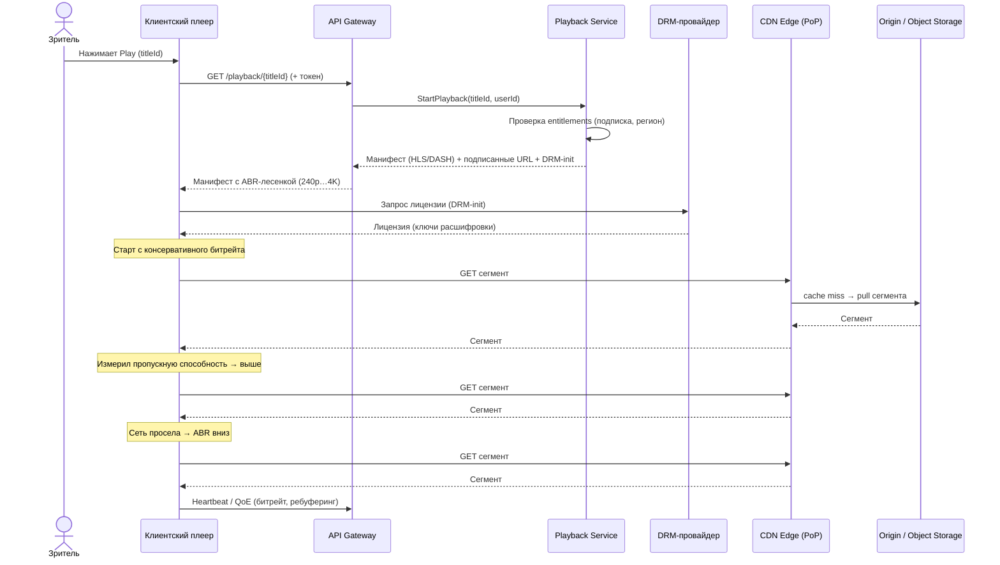
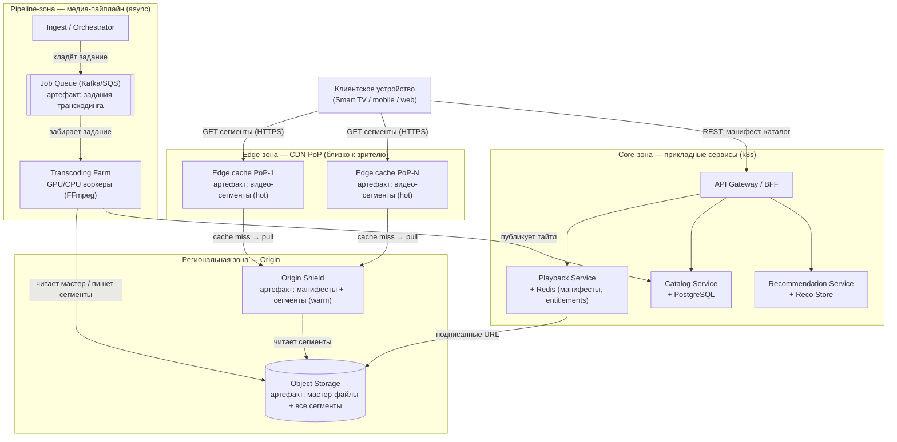
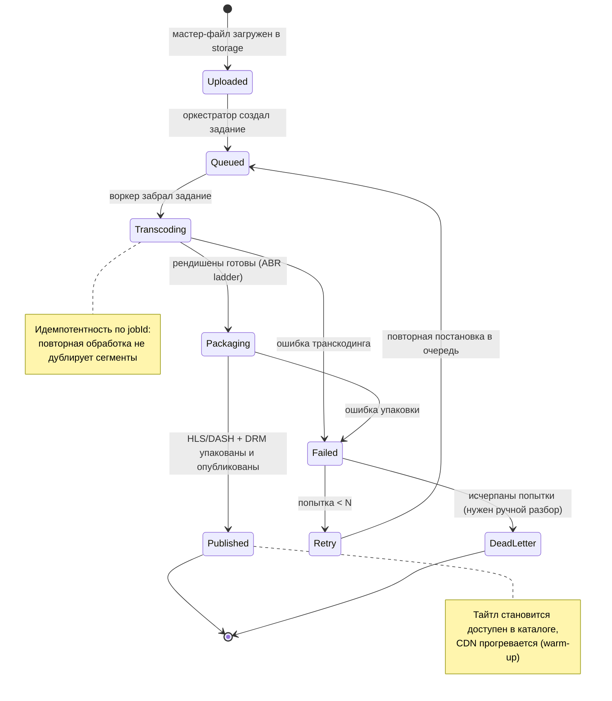

# UML — Онлайн-кинотеатр

Три диаграммы, дополняющие C4: динамика старта воспроизведения (sequence), физическое размещение по зонам (deployment) и жизненный цикл задания транскодинга (state machine).

---

## 1. Sequence — старт воспроизведения через CDN с выбором битрейта (ABR)

Что показывает: путь от нажатия Play до первого кадра. Плеер получает манифест с ABR-лесенкой, скачивает сегменты с CDN edge (cache hit/miss с тягой из origin) и адаптирует битрейт по измеренной пропускной способности. Зачем: видно, что тяжёлый трафик идёт мимо прикладных сервисов, а Playback Service лишь авторизует и собирает манифест.

---

## 2. Deployment — edge → origin → transcoding farm → storage

Что показывает: физическое размещение по зонам. Edge-узлы (CDN PoP) стоят близко к зрителю и кэшируют сегменты; региональный origin отдаёт промахи кэша из object storage; в core-зоне работают прикладные сервисы и асинхронная transcoding farm. Зачем: видно, где кэшируется трафик и почему origin видит <5% запросов.

---

## 3. State machine — жизненный цикл задания транскодинга

Что показывает: статусы одного задания от загрузки мастер-файла до публикации, с ветками сбоев и ретраев. Зачем: это контракт медиа-пайплайна — на нём строятся мониторинг лага, алерты и идемпотентность воркеров (см. ADR-0002).

