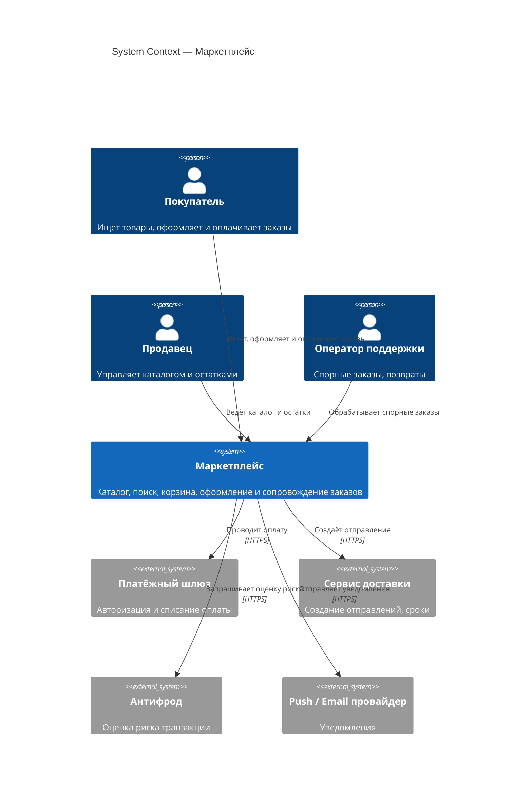
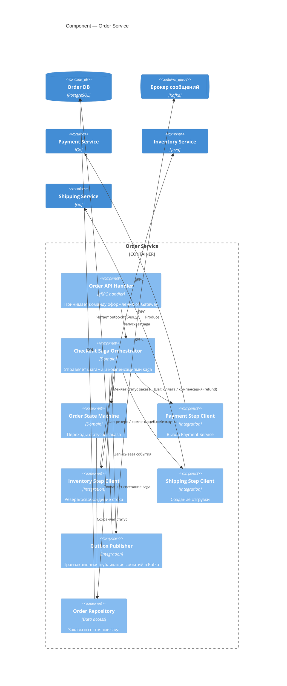

# C4 — Маркетплейс

Три уровня C4: System Context (L1) → Container (L2) → Component (L3, раскрыт **Order Service**). Уровни не смешиваются: на L1 нет контейнеров и БД, на L2 — деплоимые единицы и протоколы, на L3 — внутренние компоненты одного контейнера.

## Level 1 — System Context

**Граница системы:** всё внутри «Маркетплейс» — наше; платёжный шлюз, доставка, антифрод и провайдер уведомлений — внешние, мы их не разрабатываем, обращаемся через адаптеры.

## Level 2 — Container

```mermaid
C4Container
    title Container — Маркетплейс

    Person(buyer, "Покупатель")
    Person(seller, "Продавец")

    System_Boundary(marketplace, "Маркетплейс") {
        Container(webApp, "Web / Mobile App", "SPA / iOS / Android", "Каталог, поиск, корзина, оформление")
        Container(sellerPortal, "Кабинет продавца", "SPA", "Управление каталогом и остатками")
        Container(api, "API Gateway / BFF", "Go", "Точка входа, аутентификация, роутинг")

        Container(catalogSvc, "Catalog Service", "Java", "Карточки товаров, SKU, категории")
        Container(searchSvc, "Search Service", "Go", "Полнотекстовый поиск и фасеты")
        Container(cartSvc, "Cart Service", "Go", "Корзины покупателей")
        Container(orderSvc, "Order Service", "Go", "Жизненный цикл заказа, оркестрация saga")
        Container(paymentSvc, "Payment Service", "Go", "Оплата через шлюз, идемпотентность")
        Container(inventorySvc, "Inventory Service", "Java", "Остатки и резервирование стока")
        Container(shippingSvc, "Shipping Service", "Go", "Отправления, интеграция с доставкой")

        ContainerDb(catalogDb, "Catalog DB", "PostgreSQL", "Товары, SKU, категории")
        ContainerDb(searchIdx, "Search Index", "OpenSearch", "Инвертированный индекс каталога")
        ContainerDb(cartDb, "Cart DB", "Redis", "Корзины (TTL)")
        ContainerDb(orderDb, "Order DB", "PostgreSQL", "Заказы, состояние saga")
        ContainerDb(paymentDb, "Payment DB", "PostgreSQL", "Платежи, статусы")
        ContainerDb(inventoryDb, "Inventory DB", "PostgreSQL", "Остатки, резервы")
        ContainerQueue(broker, "Брокер сообщений", "Kafka", "События домена, CDC каталога")
    }

    System_Ext(payment, "Платёжный шлюз")
    System_Ext(shipping, "Сервис доставки")
    System_Ext(antifraud, "Антифрод")
    System_Ext(notify, "Push / Email провайдер")

    Rel(buyer, webApp, "Использует")
    Rel(seller, sellerPortal, "Использует")
    Rel(webApp, api, "REST/HTTPS")
    Rel(sellerPortal, api, "REST/HTTPS")

    Rel(api, catalogSvc, "gRPC")
    Rel(api, searchSvc, "gRPC")
    Rel(api, cartSvc, "gRPC")
    Rel(api, orderSvc, "gRPC")

    Rel(catalogSvc, catalogDb, "SQL")
    Rel(catalogSvc, broker, "Публикует изменения товаров (CDC)")
    Rel(searchSvc, searchIdx, "Индексирует и ищет")
    Rel(searchSvc, broker, "Подписан на изменения каталога")
    Rel(cartSvc, cartDb, "Читает/пишет")

    Rel(orderSvc, orderDb, "SQL + outbox")
    Rel(orderSvc, broker, "Команды/события saga")
    Rel(orderSvc, paymentSvc, "Шаг saga: оплата", "gRPC")
    Rel(orderSvc, inventorySvc, "Шаг saga: резерв", "gRPC")
    Rel(orderSvc, shippingSvc, "Шаг saga: отгрузка", "gRPC")

    Rel(paymentSvc, paymentDb, "SQL")
    Rel(paymentSvc, payment, "Проводит оплату", "HTTPS")
    Rel(paymentSvc, antifraud, "Оценка риска", "HTTPS")
    Rel(inventorySvc, inventoryDb, "SQL")
    Rel(shippingSvc, shipping, "Создаёт отправление", "HTTPS")
    Rel(orderSvc, notify, "Триггерит уведомления", "HTTPS")
```

Каждый контейнер — отдельно деплоимая единица со своей БД (см. [ADR-0001](../adr/0001-database-per-service.md)), это **не** Docker-контейнер. Order Service выступает оркестратором checkout-saga.

## Level 3 — Component (Order Service)

Оркестратор и outbox обеспечивают надёжность: состояние saga персистентно, события публикуются транзакционно (паттерн Transactional Outbox), что даёт идемпотентные повторы при сбоях.
