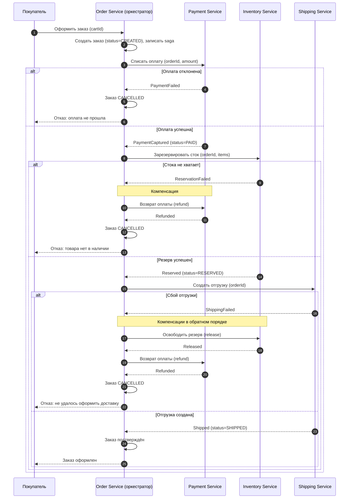
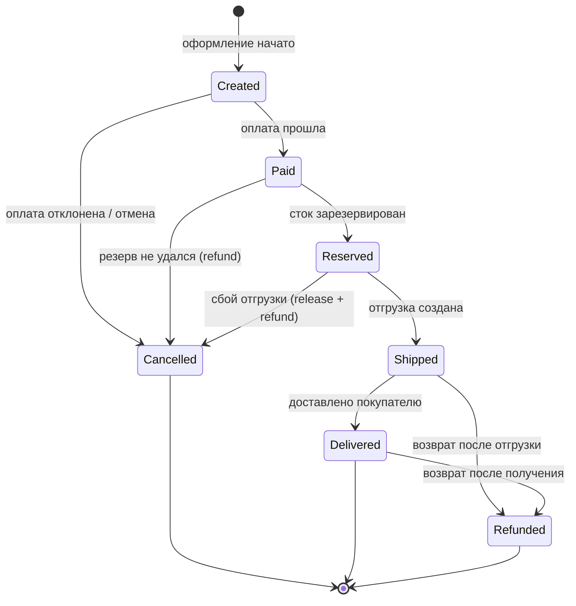
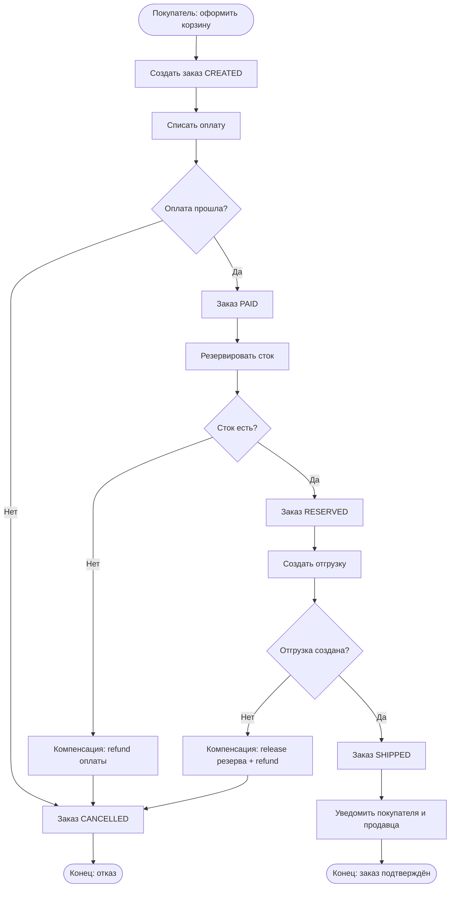

# UML — Маркетплейс

Три диаграммы, дополняющие C4: динамика checkout-saga (sequence), жизненный цикл заказа (state machine) и бизнес-процесс оформления (activity). Дублирующих диаграмм нет — каждая отвечает на свой вопрос.

## 1. Sequence — Checkout-saga (оркестрация)

**Что показывает:** как Order Service оркеструет распределённую транзакцию оформления заказа: оплата → резерв стока → отгрузка, и как выполняются **компенсации** при сбое шага. Главное — порядок шагов и откат уже выполненных действий, чтобы деньги и сток остались согласованы.

## 2. State machine — Жизненный цикл заказа

**Что показывает:** допустимые статусы заказа и переходы между ними. Подчёркивает, что переходы строго направлены (нельзя «отгрузить» неоплаченный заказ), а отмена/возврат возможны только из определённых состояний.

## 3. Activity — Оформление заказа (от корзины до подтверждения)

**Что показывает:** бизнес-процесс с точками принятия решений: проверка наличия стока и результата оплаты. Видны ветви отказа и компенсаций, которые в sequence показаны как сообщения, а здесь — как шаги процесса.

