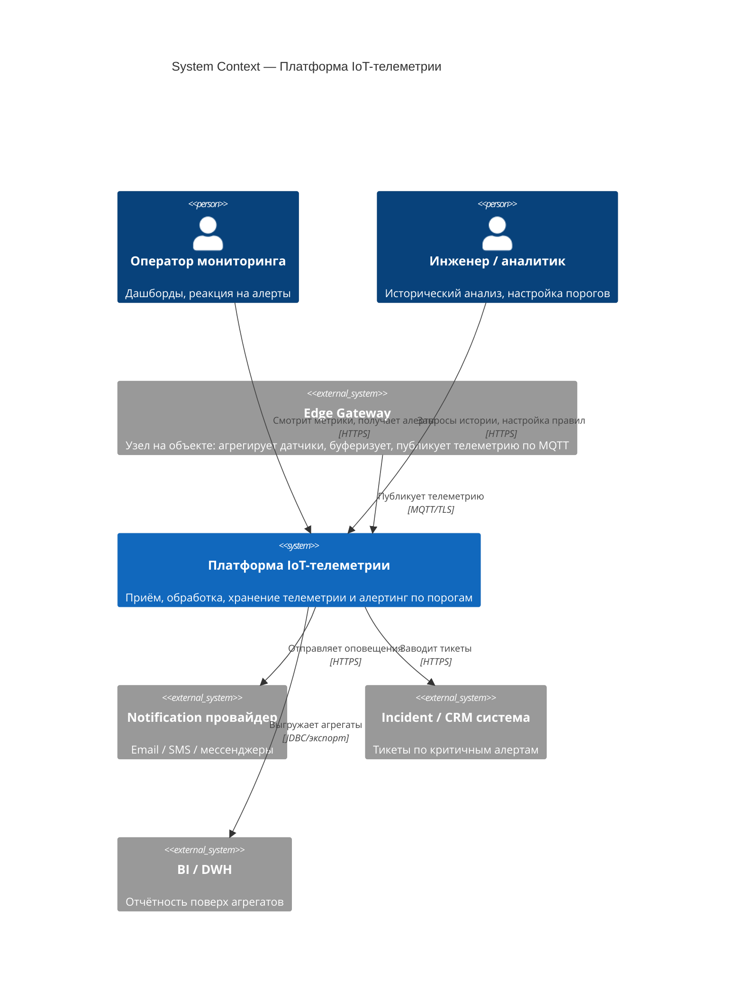
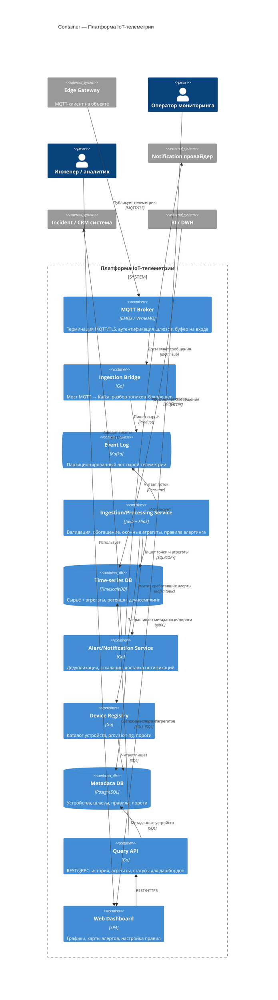
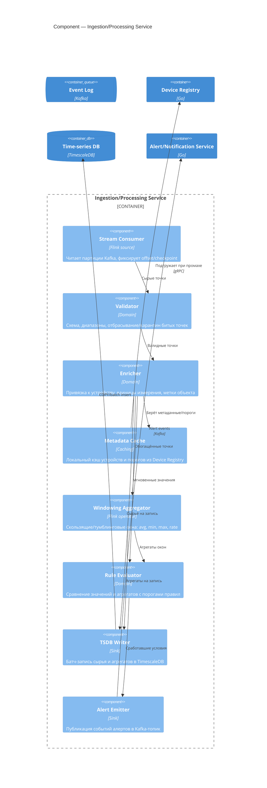

# C4 — Платформа IoT-телеметрии

> Уровни не смешиваются: на Context — только система, акторы и внешние системы; на Container — деплоимые единицы; на Component раскрыт один контейнер.

## Level 1 — System Context

**Граница системы:** всё внутри «Платформы IoT-телеметрии» — наше. Edge Gateway показан как внешняя система: его прошивку/агента мы не разрабатываем, у нас с ним только контракт MQTT (см. [ADR-0001](../adr/0001-mqtt-edge-gateway.md)). Notification, Incident/CRM и BI — внешние интеграции.

## Level 2 — Container

Каждый контейнер — отдельно деплоимая и масштабируемая единица (это **не** Docker-контейнер). Поток приёма (`broker → bridge → kafka → processing → tsdb`) и тракт чтения (`queryApi → tsdb`) физически разделены.

## Level 3 — Component (контейнер «Ingestion/Processing Service»)

**Идея компонентов:** приём и обработка идут одним конвейером поверх Flink — это даёт exactly-once запись и единое место для оконных агрегатов и правил (см. [ADR-0003](../adr/0003-stream-processing.md), [ADR-0004](../adr/0004-alerting-rules.md)). `Metadata Cache` снимает нагрузку с Device Registry: пороги читаются на каждом сообщении, но меняются редко.
