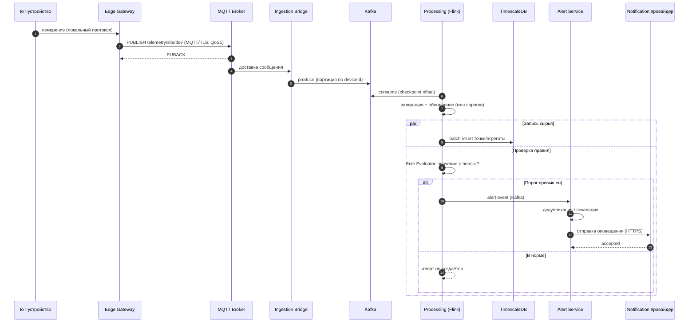
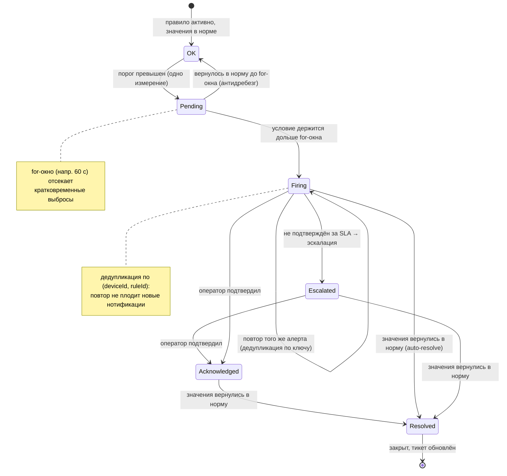
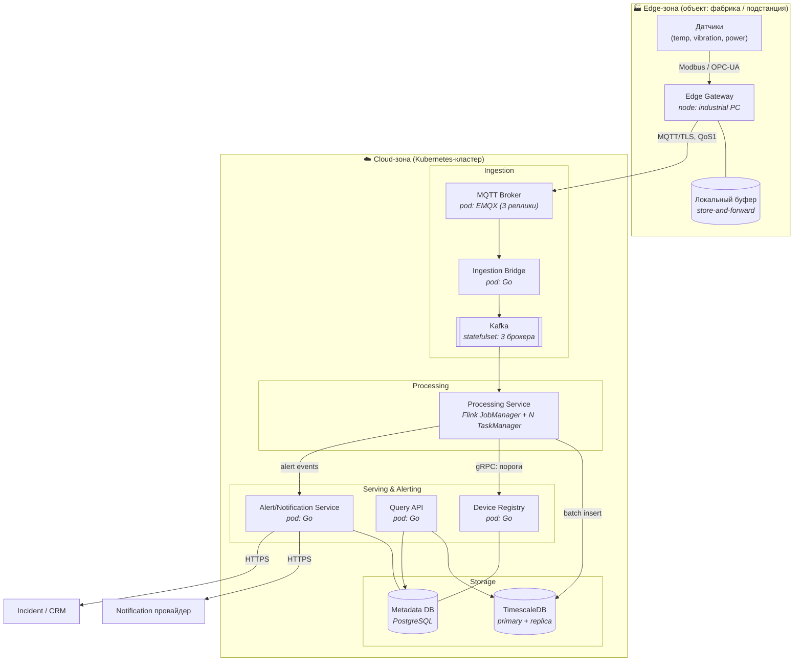

# UML — Платформа IoT-телеметрии

Три диаграммы: сквозной сценарий приёма и алертинга (sequence), жизненный цикл алерта (state machine) и физическое размещение (deployment).

## 1. Sequence — ingest → обработка → алерт

Показывает путь одной точки телеметрии от устройства до нотификации: публикация через edge gateway по MQTT, перекладка в Kafka, обработка в потоке (валидация, обогащение, проверка порога), запись в TSDB и доставка алерта. Зачем: видно, где данные становятся доступны на чтение и в какой момент рождается алерт — и что запись сырья и эмиссия алерта идут параллельно.

## 2. State machine — жизненный цикл алерта

Показывает состояния алерта от обнаружения до закрытия с дедупликацией и эскалацией. Зачем: алертинг — не «однократное событие», а конечный автомат; это объясняет, почему `Alert Service` хранит состояние (см. [ADR-0004](../adr/0004-alerting-rules.md)) и как гасятся «дребезг» и повторные срабатывания.

## 3. Deployment — edge → cloud

Показывает физическое размещение: edge-зона на объекте (gateway + локальные датчики и буфер) и облачная зона (ingestion, processing, storage, alerting). Зачем: видно границу edge/cloud, какие артефакты где крутятся и какой канал между зонами — это обосновывает буферизацию на gateway и MQTT поверх ненадёжного канала (см. [ADR-0001](../adr/0001-mqtt-edge-gateway.md)).

