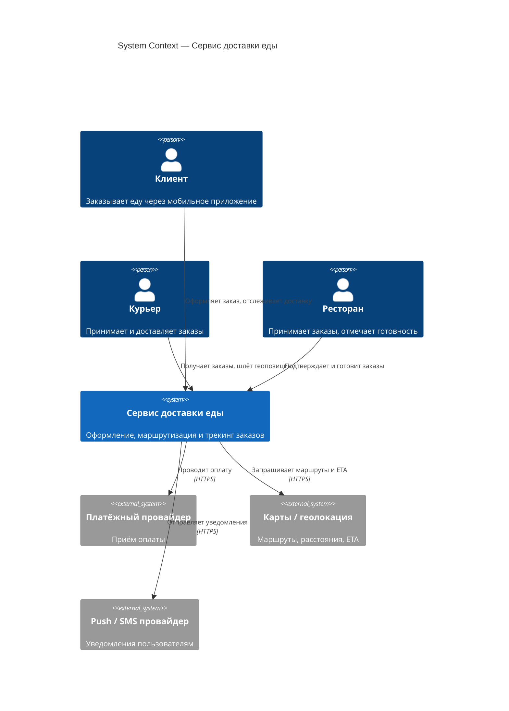
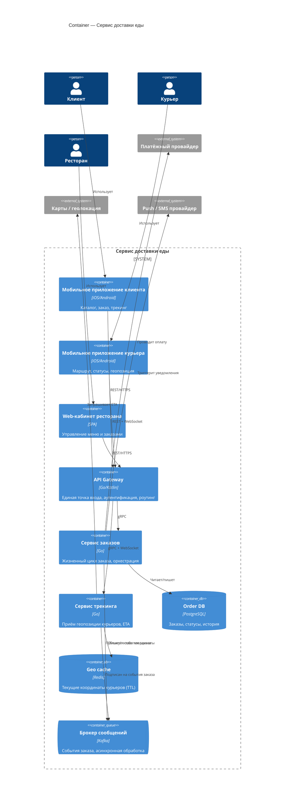
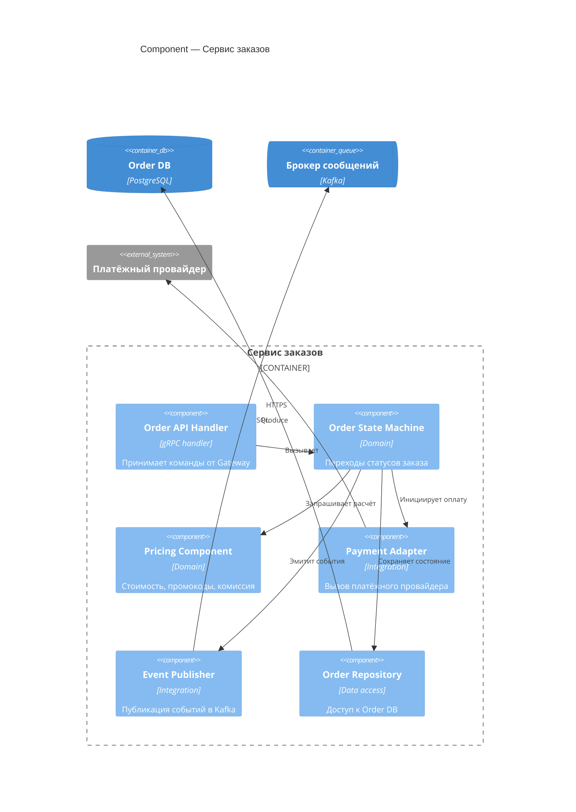

# Референсное решение самостоятельной работы. Кейс «Сервис доставки еды»

> 💡 **Как открыть:** просматривайте этот файл в GitHub, VS Code, Obsidian или Typora — так корректно отрисуются Mermaid-диаграммы. В Блокноте они будут видны как текстовый код.

> Это **один из возможных** вариантов, а не единственно правильный. Цель — показать ожидаемый уровень детализации и связность C4 → ADR → arc42. Ваше решение может отличаться составом контейнеров и выбором решений — важно, чтобы уровни не смешивались, а у ADR были честные Consequences.

---

## Часть 1. C4

### Level 1 — System Context

**Граница системы:** всё, что внутри «Сервис доставки еды», — наше; платёжный провайдер, карты и push/SMS — внешние, мы их не разрабатываем.

### Level 2 — Container

Каждый контейнер — отдельно деплоимая единица (это **не** Docker-контейнер).

### Level 3 — Component (пример для «Сервиса заказов»)

---

## Часть 2. ADR

### ADR-0001. Трекинг курьера через WebSocket + Redis

- **Status:** Accepted
- **Context.** Клиент должен видеть курьера на карте с задержкой ≤ 5 с. Курьеров на пике — десятки тысяч, каждый шлёт координаты раз в 3–5 с. Нужна низкая задержка доставки координат клиенту и устойчивость к пиковым нагрузкам. Рассматривались: HTTP-поллинг, WebSocket, очередь + push.
- **Decision.** Курьер шлёт координаты по WebSocket в Сервис трекинга; актуальная позиция хранится в Redis с коротким TTL; клиент получает обновления тоже по WebSocket (подписка на заказ).
- **Consequences.**
  - **+** Низкая задержка (push, а не поллинг); меньше пустых запросов; Redis с TTL даёт дёшево «текущее состояние» без раздувания БД.
  - **+** Горизонтально масштабируется по количеству соединений.
  - **−** WebSocket сложнее в эксплуатации, чем stateless HTTP: нужен sticky-роутинг/шина для fan-out между инстансами.
  - **−** Координаты в Redis эфемерны — для истории маршрута нужен отдельный поток в БД/аналитику.
  - **−** Мобильные сети рвут соединения — нужна логика переподключения на клиенте.

### ADR-0002. Оформление заказа через очередь (асинхронная обработка пиков)

- **Status:** Accepted
- **Context.** Пики в обед и вечером дают всплески оформления заказов. Синхронная обработка «в запросе» (резерв, оплата, назначение ресторана, поиск курьера) в пик приводит к таймаутам и потере заказов — а бизнес явно требует «не терять заказы при пиках».
- **Decision.** На оформлении принимаем заказ синхронно только до статуса «принят» (валидация + создание записи + событие `OrderCreated` в Kafka). Дальнейшие шаги (оплата, уведомление ресторана, поиск курьера) обрабатываются асинхронно консьюмерами.
- **Consequences.**
  - **+** Пики сглаживаются буфером очереди; заказы не теряются, а ставятся в обработку.
  - **+** Шаги обработки независимо масштабируются и переживают временную недоступность внешних систем (retry).
  - **−** Eventual consistency: клиент видит «заказ принят» до подтверждения оплаты/ресторана → нужна понятная модель статусов в UI.
  - **−** Рост сложности: идемпотентность консьюмеров, обработка частичных сбоев, мониторинг лагов очереди.
  - **−** Сложнее отлаживать сквозной сценарий (распределённая трассировка обязательна).

---

## Часть 3. arc42 (минимальный скелет)

### §1 Introduction and Goals

Сервис доставки еды связывает клиентов, рестораны и курьеров: оформление заказа, оплата, маршрутизация и трекинг курьера в реальном времени. Масштаб — ~500K заказов в день с выраженными пиками.

**Quality goals (с цифрами):**

| Цель | Метрика |
|------|---------|
| Быстрое оформление | Создание заказа (до статуса «принят») p95 < 3 с |
| Актуальный трекинг | Задержка обновления позиции курьера ≤ 5 с |
| Надёжность в пик | Не терять заказы при 3× средней нагрузки; доступность 99.9% |

**Стейкхолдеры:** клиент, курьер, ресторан, команда поддержки, биллинг.

### §4 Solution Strategy

- Сервисная декомпозиция по доменам (заказы, трекинг) за единым API Gateway.
- Асинхронная обработка пиков через Kafka (см. ADR-0002).
- Real-time трекинг через WebSocket + Redis (см. ADR-0001).
- Внешние системы (оплата, карты, push) — через адаптеры с таймаутами и retry.

### §5 Building Block View

См. C4-диаграммы из Части 1: System Context → Container → Component (Сервис заказов).

### §9 Architecture Decisions

- ADR-0001 — Трекинг через WebSocket + Redis (Accepted)
- ADR-0002 — Оформление заказа через очередь (Accepted)

---

## Что отличает хорошее решение от слабого (на этом кейсе)

| Слабое решение | Хорошее решение |
|----------------|-----------------|
| На Context нарисованы контейнеры и БД | На Context — только система, акторы, внешние системы |
| Не видно границы: оплата нарисована как «наш модуль» | Платёжный провайдер явно помечен как внешний |
| ADR описывает только плюсы Kafka | ADR честно перечисляет eventual consistency и рост сложности |
| Quality goals: «быстро», «надёжно» | Quality goals: «p95 < 3 с», «99.9%», «≤ 5 с» |
| 8 диаграмм, дублирующих друг друга | Context + Container + один Component — минимально достаточно |
